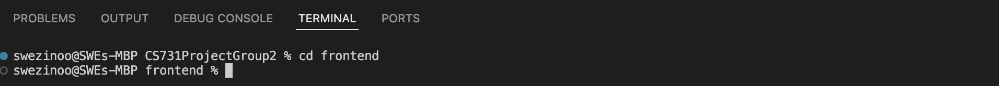
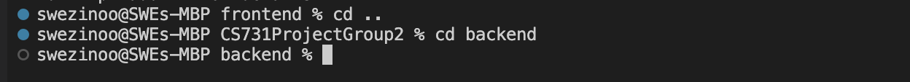
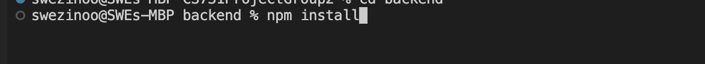
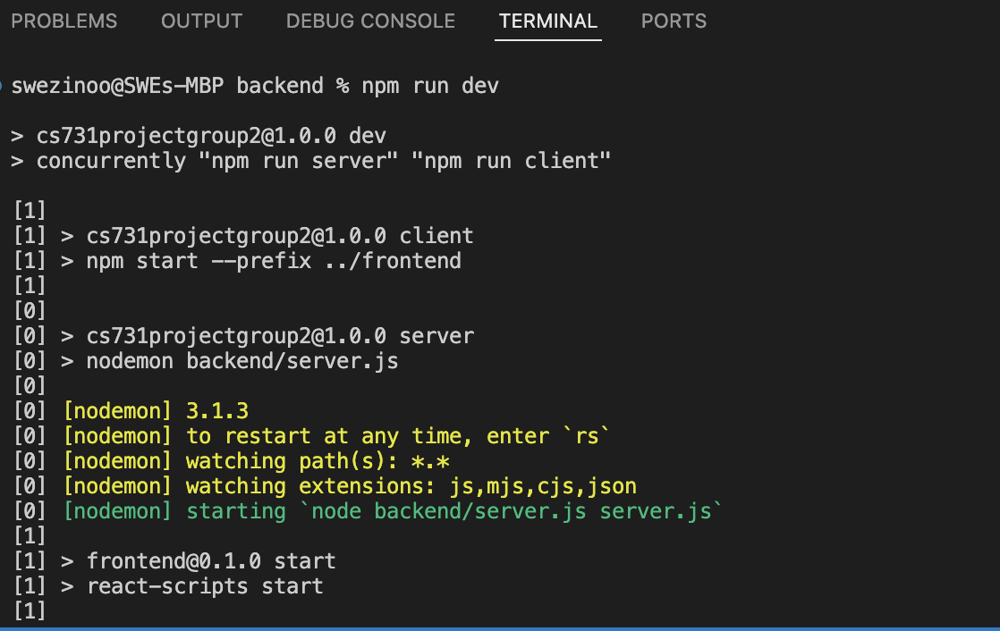

# About The Project

## Course Management Platform

The Course Management Platform is a web application that helps course instructors
and students interact with courses more effectively online, anywhere and anytime.
It allows a course instructor to create a course, register students in the course and upload course content for students. For students, they are able to view the courses’ details in which they are registered and access the course content.

# New Features for Phase 2

## 1) Adding and Sharing Notes Features in Course Interaction

## 2) Adding and deleting course content categories

### Test account

email : emily@gmail.com
password :12345

# Build With

The project is built with the MERN framework and the Material UI library using Visual Studio Code on macOS. We use MongoDB for the database, Express.js and Node.js for the server-side, and React for the client-side. We built the project according to the MERN stack.

# Getting Started

## Prerequisites

To get started, you need to

1.  install Node.js on your computer. If it is not already installed, download Node.js v20.14.0 from the link below. This version is used in this project.
    https://nodejs.org/en/
2.  Install a code editor such as Atom, JetBrains WebStorm, or Visual Studio Code. We use Visual Studio Code for this project.
3.  Mac OS or Window OS.
4.  An internet connection to check out the project from the repository.

## Installation

1. Clone the repo
   git clone https://github.com/NuNuLwin/CS731ProjectGroup2.git

## Usage

Please follow the below steps to run the project:

1. Open the 'CS731ProjectGroup2' project in Visual Studio Code.
2. Navigate to the 'Terminal' in Visual Studio Code.
3. Use the terminal to navigate to the project's 'frontend' folder by entering the command below.
   
    

4. Install dependencies used for the frontend side by entering the command below.
   
    

5. Navigate to the project's 'backend' folder by entering the command below in the terminal.
   
    

6. Install dependencies used for the backend side by entering the command below.
   
    

7. Finally, launch the project by running 'npm run dev' in the terminal. You will see the Course Management Platform running on the browser that you have installed.
   

# Contact

[swezinoo410@gmail.com](mailto:swezinoo410@gmail.com)  
[cws.nunu@gmail.com](mailtocws.nunu@gmail.com)
